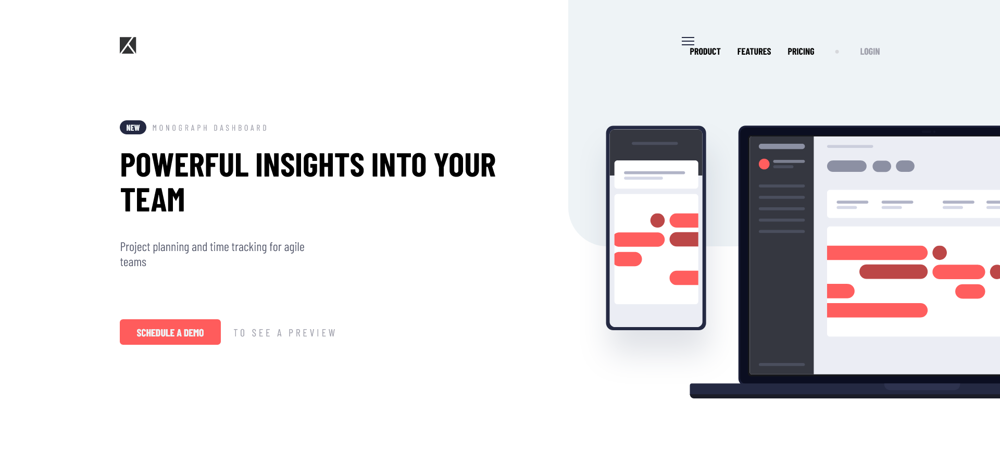
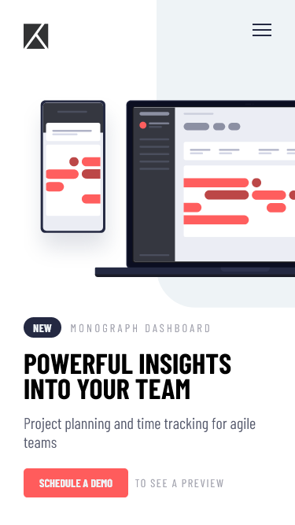

# Frontend Mentor - Project tracking intro component solution

This is a solution to the [Project tracking intro component challenge on Frontend Mentor](https://www.frontendmentor.io/challenges/project-tracking-intro-component-5d289097500fcb331a67d80e). Frontend Mentor challenges help you improve your coding skills by building realistic projects. 

## Table of contents

- [Frontend Mentor - Project tracking intro component solution](#frontend-mentor---project-tracking-intro-component-solution)
  - [Table of contents](#table-of-contents)
  - [Overview](#overview)
    - [The challenge](#the-challenge)
    - [Screenshot](#screenshot)
    - [Links](#links)
  - [My process](#my-process)
    - [Built with](#built-with)
    - [What I learned](#what-i-learned)
  - [Author](#author)

**Note: Delete this note and update the table of contents based on what sections you keep.**

## Overview

### The challenge

Users should be able to:

- View the optimal layout for the site depending on their device's screen size
- See hover states for all interactive elements on the page
- Create the background shape using code

### Screenshot

**Desktop view**


**Mobile view**



### Links

- Solution URL: [Github](https://github.com/gylim0604/FrontEndMentor-project-tracking-component)
- Live Site URL: [Vercel](https://front-end-mentor-project-tracking-component.vercel.app/)

## My process

### Built with

- Semantic HTML5 markup
- Flexbox|
- SCSS
- Mobile-first workflow

### What I learned

Biggest takeaway is that I'm not familiar enough with the overflow property. It took me awhile to figure out how to correctly hide part of the image. It kept hiding on the x axis, but displayed a scrollbar on the Y axis even when the overflow-y property was set to visibile. I think it might be something to do with how the overflow property is configured, but I will have to read more in the docs.

```css
html{
    overflow: hidden;
}
body{
    overflow-x: hidden;
}

```
## Author
- Frontend Mentor - [@gylim0604](https://www.frontendmentor.io/profile/gylim0604)

